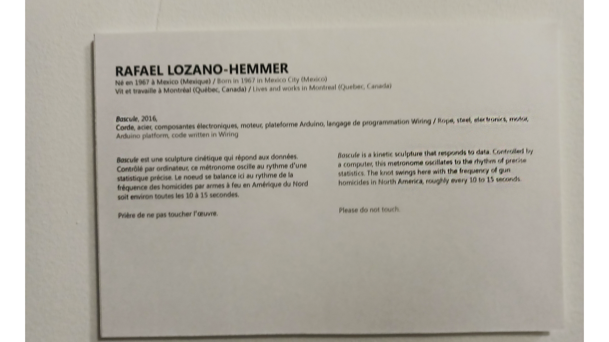

# Bascule

## Rafael Lozano-Hemmer

2016

BIAN

Arsenal Art Contemporain Montréal

9 février 2022

## Description de l'oeuvre ou du dispositif multimédia
*Bascule* est une sculpture cinétique qui répond aux données. Contrôlé par ordinateur, ce métronome oscille au rythme d'une statistique précise. Le noeud se balance ici au rythme de la fréquence des homicides par armes à feu en Amérique du Nord soit environ toutes les 10 à 15 secondes.

Explications sur la mise en espace de l'oeuvre ou du dispositif
La corde est tressé autour d'une barre en acier verticale afin qu'elle puisse se tenir sur elle-même. Elle est enfoncée dans un moteur qui fait la corde basculer chaque 10 à 15 secondes. Elle nécissite de 100W sur 110 à 240V qu'elle prend d'une prise électrique au mur.

(Source: https://www.lozano-hemmer.com/sway.php)

Corde, acier, composantes électroniques, moteur, plateforme Arduino, language de programmation Wiring

(Source: Cartel d'exposition au BIAN)

## Expérience vécue:
-Description de votre expérien ce de l'oeuvre ou du dispositif, de l'interactivité, des gestes à poser, etc.

-Ce qui vous à plu, vous a donné des idées et justifications

-Aspect que vous ne souhaiteriez pas retenir pour vos propres créations ou que vous feriez autrement et justifications

## Références

https://www.lozano-hemmer.com/sway.php
