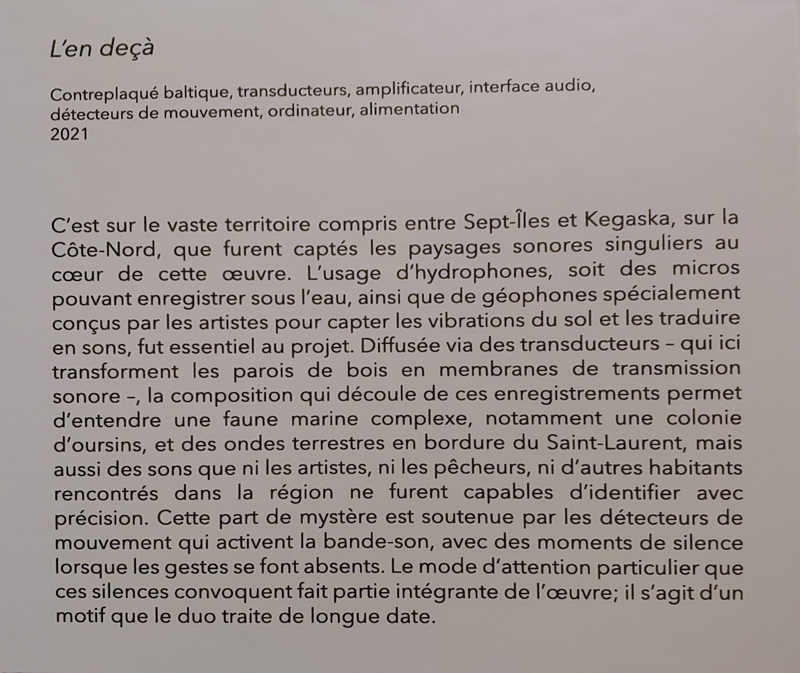
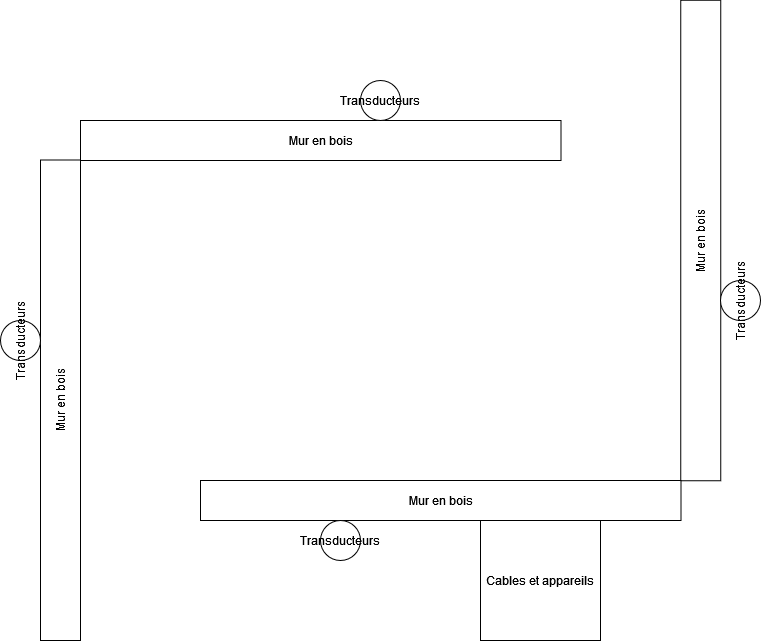
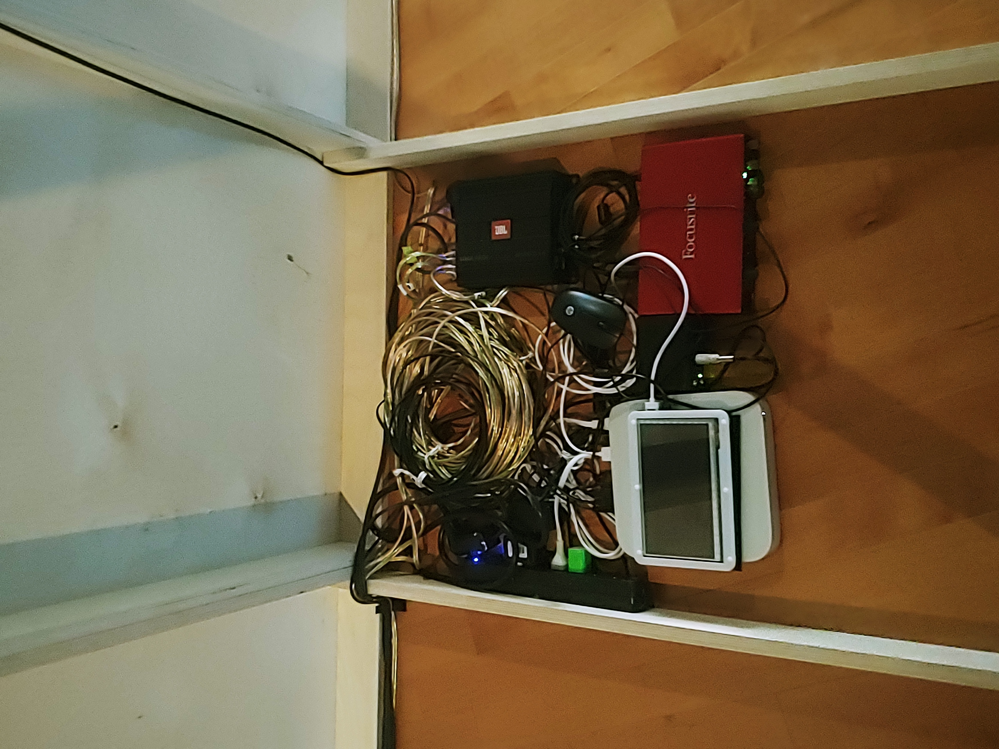
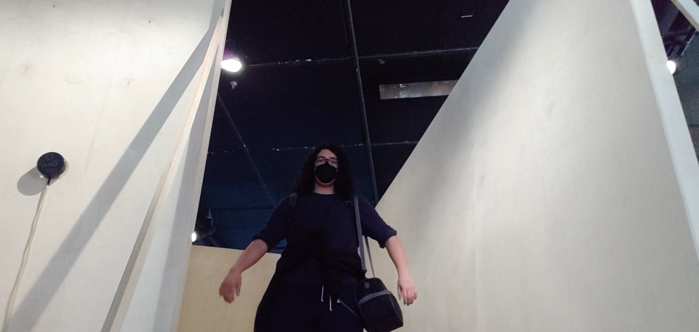

# L'EN DEÇA

## Béchard & Hudon
2022

Configuartions du sensible

Maison des arts de Laval

Mercredi le 16 mars 2022

## Description de l'oeuvre ou du dispositif multimédia
C’est sur le vaste territoire compris entre Sept-Îles et Kegaska, sur la Côte-Nord que furent captés les paysages sonores singuliers au cœur de cette œuvre. L’usage d’hydrophones, soit des micros pouvant enregistrer sous l’eau, ainsi que de géophones spécialement conçus par les artistes pour capter les vibrations du sol et les traduire en sons, fut essentiel au projet. Diffusée via des transducteurs – qui ici transforment les parois de bois en membranes de transmission sonore –, la composition qui découle de ces enregistrements permet d’entendre une faune marine complexe, notamment une colonie d’oursins, et des ondes terrestres en bordure du Saint-Laurent, mais aussi des sons que ni les artistes, ni les pêcheurs, ni d’autres habitants rencontrés dans la région ne furent capables d’identifier avec précision. Cette part de mystère est soutenue par les détecteurs de mouvement qui activent la bande-son, avec des moments de silence lorsque les gestes se font absents. Le mode d’attention particulier que ces silences convoquent fait partie intégrante de l’œuvre; il s’agit d’un motif que le duo traite de longue date.

(Source: Cartel d'exposition)

Les murs en bois sont adosées pour qu'ils se tiennent debout. Chaque mur a un transducteur qui émet des sons qui résonnent dans la petite pièce formée par les quatre murs. Au liew d'haut-parleurs normaux, les transducteurs font en sorte que les murs eux-mêmes vibrent avec le son. De cette façon, la personne à l'intérieur de l'oeuvre aura l'impression d'être immergée dans l'environnement crée par celle-ci.

Contreplaqué baltique, transducteurs, amplificateur, interface audio, détecteurs de mouvement, ordinateur, alimentation

Bois (Soutien les murs)

## Expérience vécue
Je me sentais réellement immergé dans l'oeuvre. J'avais l'impression d'être dans une grotte humide avec les echos des goutelettes qui tombaient autour de moi. En touchant les murs, je sentais aussi les vibrations et je pouvais m'imaginer dans cette même grotte, explorant le monde sous-terrain.

J'ai adoré à quel point j'ai rapidement été capable de m'imaginer dans un environnement différent du mien. J'aimerais que mes projets parviennent à réaliser la même chose aussi facilement, car, dans mon experience, je me sentais si joyeux d'être transporté dans un autre monde.

J'aurai préféré s'il y avait moins de bruit à l'extérieur de l'oeuvre, incluant les sons des autres oeuvres et des personnes autour. J'ai l'impression que ça nous enlève un peu de l'illusion de l'en deça. Pour régler cela, je metterai l'oeuvre dans une pièce à part, ou avoir une affiche qui nous demande de rester silencieux dans la salle.

## Références
https://bechardhudon.com/project/en-deca-2022/
https://www.laval.ca/Pages/Fr/Calendrier/mda-expo-bechard-hudon.aspx
