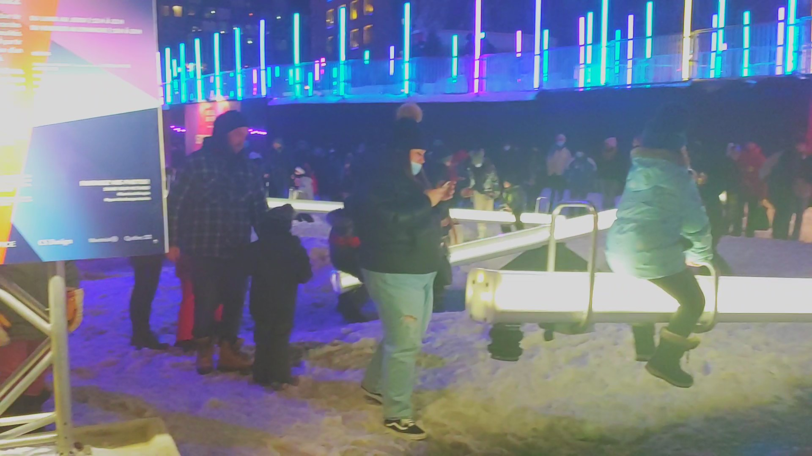

# IMPULSION

## Lateral Office / CS Design / EGP Group

2003

Luminothérapie

Quartier des spectacles Montréal

Samedi, le 5 mars, 2022

## Description de l'oeuvre ou du dispositif multimédia
_Impulsion nous fait vivre une expérience interactive de sons et de lumières. Elle présente une série de grandes bascules dont l’intensité lumineuse et les tonalités varient lorsque vous les mettez en mouvement. À partir de cet instrument urbain, participez à la création d’un environnement éphémère sans cesse renouvelé. Impulsion reprend des concepts du sérialisme, technique fondée sur la répétition d’éléments musicaux et leur variation, pour créer des zones d’intensité et de calme._

Chacune des 30 bascules sont mis en place à l'extérieur, alignées parallèlement. L'oeuvre est entourée de bâtiments ayant 9 projections en tout, chacune ayant un lien avec les bascules lumineuses. 

### Composantes et techniques de l'oeuvre ou du dispositif
Aluminium, Plastique résistant au froid, Diffuseur lenticulaire, Projecteurs

### Éléments nécessaires pour la mise en exposition
Base triangulaire

## Expérience vécue:
Malhereusement, le jour que je suis allé visiter l'oeuvre, il y avait une longue file et une immense foule autour d'elle, donc je n'ai pas pu l'expérimenter moi-même. D'après ce que j'ai pu voir, l'oeuvre était plutôt simple, en fait. Tout ce que le visiteur devait faire était d'utiliser la bascule afin qu'elle s'illumine en plus de faire un son qui est associé aux projections sur les murs des bâtiments qui l'entourent.

J'ai aimé la simplicité et l'efficacité de l'oeuvre. J'ai  comment quelque chose de si petit peut contribuer à de si larges projections. Ça montre qu'on peut faire tellement de choses grandioses sans avoir nécessairement besoin d'une installation d'une taille semblable.

-Aspect que vous ne souhaiteriez pas retenir pour vos propres créations ou que vous feriez autrement et justifications
Vu la quantité de personnes qui étaient à l'oeuvre à la fois, j'aurai préféré qu'il aie une limite de temps qu'une personne peut utiliser la bascule à la fois. Peut-être j'aurais voulu attendre pour mon tour dans ce cas.

## Références
https://www.quartierdesspectacles.com/fr/a-propos/les-productions-du-partenariat/oeuvre/2/impulsion-par-lateral-office-cs-design-en-collaboration-avec-egp-group/

## Photographies et croquis à intégrer

photographies des composantes de l'oeuvre

photographies des éléments nécessaires à sa mise en espace

croquis de la mise en espace (choisir la vue la plus pertinente : plan ou élévation)

