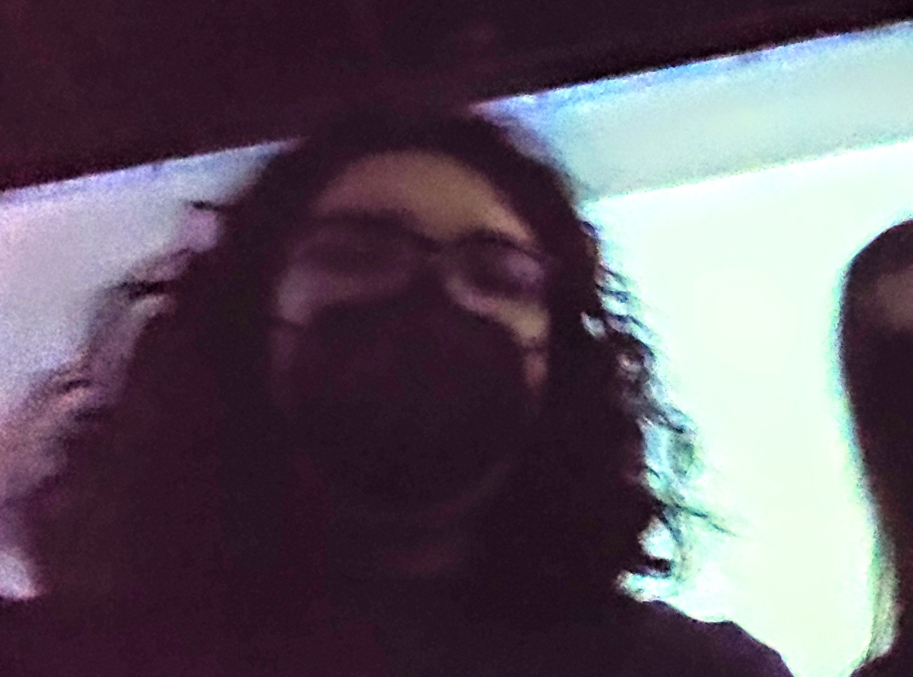

# L'horloge de l'apocalypse

## Maxime Sabourin / Louis-Philippe Gravel / Alexis Lavasse / Tristan Girard-Montpetit / Maxime De Falco

2022

Moebius

Grand studio - Collège Montmorency

Mercredi le 23 mars 2022

## Description de l'oeuvre ou du dispositif multimédia
*L’horloge de l’apocalypse représente la ligne du temps de l’humanité. Selon le concept de l’horloge, il est présentement 11 h 58 et il reste 2 minutes avant la fin de l’humanité. À travers ce projet, l’interacteur est invité à contrôler l’horloge grâce aux aiguilles et ainsi manipuler la ligne du temps. Au cours de l’expérience, vous pourrez vivre les différentes époques auxquelles la terre a été exposée. Vous serez exposé aux différents enjeux actuels à travers la projection qui vous entourera et par le fait même vous plongera dans une immersion totale.*

(Source: https://tim-montmorency.com/2022/projets/L-horloge-de-l-apocalypse/docs/web/index.html)

Un piedestal est mis au centre de la pièce, montée d'une horloge avec une barre entre l'11e et la 12e heure afin de ne pas y passer directement. À droite du piedestal, un téléphonne y est aussi monté. Trois projecteurs projettent une même image étendue sur trois murs qui change à chaque fois qu'on change l'heure de l'horloge par une heure. Des caméras et une Kinect sont placées au plafond afin de détecter lorsqu'une personne entre dans la pièce.

Kinect, Caméra, Projecteur, Horloge, Téléphone, Potentiomètre 360 degrés, Raspberry Pi, Ordinateur, Câble d'ethernet, Haut-parleurs

Piedestal, Spotlight

## Expérience vécue:
J'ai bien aimé l'exposition. Le fait de changer l'heure de l'horloge m'a fait me sentir comme un enfant, je m'amusais à bouger l'aiguille et voir les résultats de mes actions. J'ai aussi été surpris lorsque le téléphonne a commencé à sonner vers la fin. Me voir à l'écran après l'avoir déccroché a mis un sorte de poid sur mes épaules, comme si c'était de ma faute que la dernière scène, le bombardement, est arrivé. 

Ce que j'ai le plus adoré était la 7e scène. Elle était si belle, j'ai aimé les couleurs et l'ambiance de casino de celle-ci, et la musique était incroyable. Je voudrais tant avoir le fichier pour l'écouter encore. Si j'avais à faire un projet, j'aimerais que ma trame sonore évoque un sentiment semblable au mien lorsque j'ai écouté leur trame sonore.

Je ne crois pas avoir quoique ce soit à changer. Je dirais que l'oeuvre a été exécutée parfaitement, l'audio, les visuels et l'ambiance de la pièce entraient parfaitement les uns avec les autres. J'espère un jour pouvoir créer quelque chose de cette qualité.

## Références
https://tim-montmorency.com/2022/projets/L-horloge-de-l-apocalypse/docs/web/index.html

## Photographies et croquis à intégrer
croquis de la mise en espace (choisir la vue la plus pertinente : plan ou élévation)
